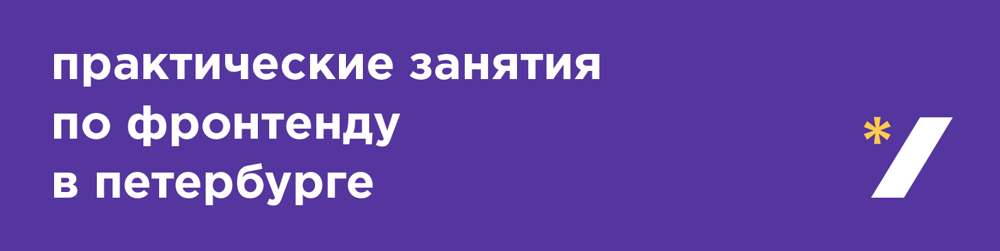
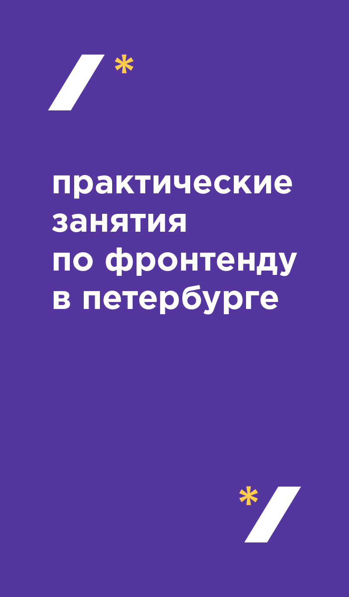
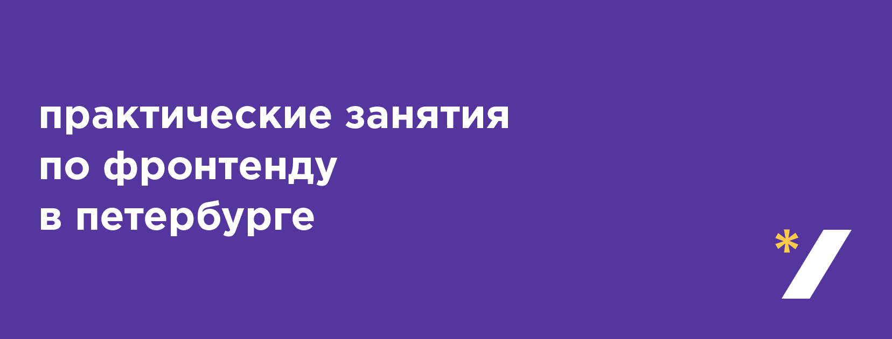

# Стиль для pitercss_class

[Шрифт Gotham Pro](https://github.com/Seafnox/Gothampro).

## Цвета

- Фиолетовый: `#55359e`
- Жёлтый: `#ffcb4d`

## Логотип

Открывающий: [SVG](logo/open.svg) или [PNG](logo/open.png) (1024 × 1024)

Закрывающий: [SVG](logo/close.svg) или [PNG](logo/close.png) (1024 × 1024)

[Исходник](logo/logo.ai) (RGB) и [наклейки](logo/logo.ai) (CMYK) в AI.

## Страницы

Верхний баннер для Вконтакте: [PNG](pages/vk-top.png) или [PSD](pages/vk-top.psd).

Правый баннер для Вконтакте: [PNG](pages/vk-right.png) или [PSD](pages/vk-right.psd).

Баннер для Фейсбука: [PNG](pages/facebook.png) или [PSD](pages/facebook.psd).

## События

- Анонс класса в соцсетях: [PSD](events/social.psd).
- Фоновая картинка для десктопа: [PSD](events/desktop.psd).
- Шаблон для фотографии: [PSD](events/photo.psd).

## Стрелки

Стрелка для указателей: [PDF](arrows/arrows.pdf) или [AI](arrows/arrows.ai) (CMYK).

